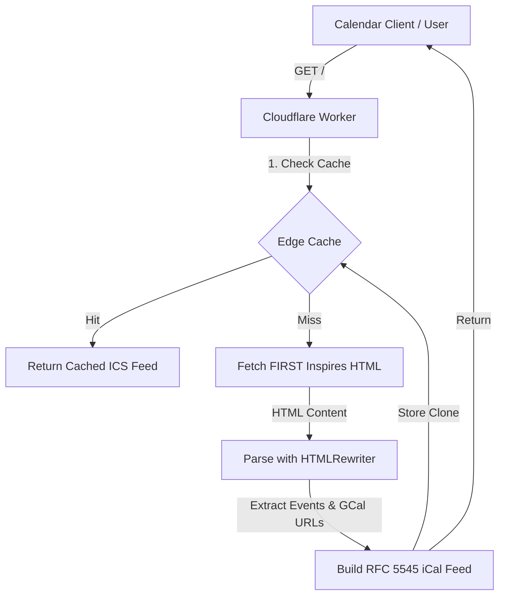

# FRC Calendar Sync (Cloudflare Worker)

A serverless Cloudflare Worker that dynamically synchronizes calendar events from the official **FIRST Robotics Competition (FRC)** milestones page and exports them as an iCalendar (`.ics`) feed. This feed is fully compatible with popular calendar applications like Google Calendar, Apple Calendar, and Outlook.

- **Source URL**: `https://www.firstinspires.org/programs/calendar?view=list&program=frc`
- **Output Feed Format**: iCalendar standard (RFC 5545) with `text/calendar` MIME type.

---

## How It Works



1. **Request Lifecycle**: When a client requests the feed, the Worker intercepts the request.
2. **HTML Retrieval**: If there is a cache miss, the Worker fetches the live FRC calendar list view page from `firstinspires.org`.
3. **HTML Parsing (`HTMLRewriter`)**:
   - The Worker parses the HTML on the fly using Cloudflare's native, streaming HTML parser (`HTMLRewriter`).
   - It targets lightbox modals (`div.calendar-lightbox-content`) which hold deep event metadata (such as programs, categories, descriptions, and the "Add to Google Calendar" button).
4. **iCal Conversion**:
   - The Google Calendar link parameters (`dates`, `text`, `location`, `ctz`, `details`) are decoded and parsed.
   - The extracted data is sanitized, HTML-decoded, and wrapped into standard iCal `VEVENT` entries with support for both all-day and timed events.
5. **Output**: Returns an `.ics` file attachment with UTF-8 encoding.

---

## Cache Control

To ensure fast load times and minimize subrequests (to avoid rate limits or performance degradation on FIRST Inspires), caching is built directly into the Worker at the edge.

### Cache Strategy

* **Edge Caching via Cache API**: The Worker uses Cloudflare's `caches.default` instance to store the output. The cache is local to the edge datacenter serving the request.
* **TTL (Time to Live)**:
  * Successful calendar responses are returned with the header:
    ```http
    Cache-Control: public, max-age=3600
    ```
  * The edge cache stores the response based on the above instruction, meaning once fetched, the calendar is cached at the edge for **1 hour**.
* **Cache Key**: Stored using the full request URL as the identifier.

### Cache Bypassing

For debugging, forcing updates, or testing, you can bypass the cache by appending the `bypass=true` query parameter:

```
https://frc-calendar-sync.YOUR-SUBDOMAIN.workers.dev/?bypass=true
```

When this parameter is present:
- The Worker ignores the edge cache and fetches live data from the origin.
- The newly fetched data is parsed and returns fresh.
- The fresh response is **not** written back to the cache to prevent cache-pollution/invalidation loops.

---

## Development and Deployment

### Prerequisites
* [Node.js](https://nodejs.org/) (v18+)
* [npm](https://www.npmjs.com/)

### Installation
Install the project dependencies:
```bash
npm install
```

### Local Development
Run the Wrangler dev server locally:
```bash
npx wrangler dev
```
Open `http://localhost:8787` in your browser or run the scratch test script to verify:
```bash
node scratch/test.js
```

### Deployment
Publish the worker to Cloudflare's network:
```bash
npx wrangler deploy
```
